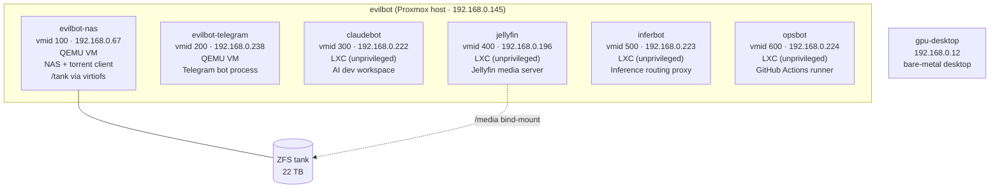
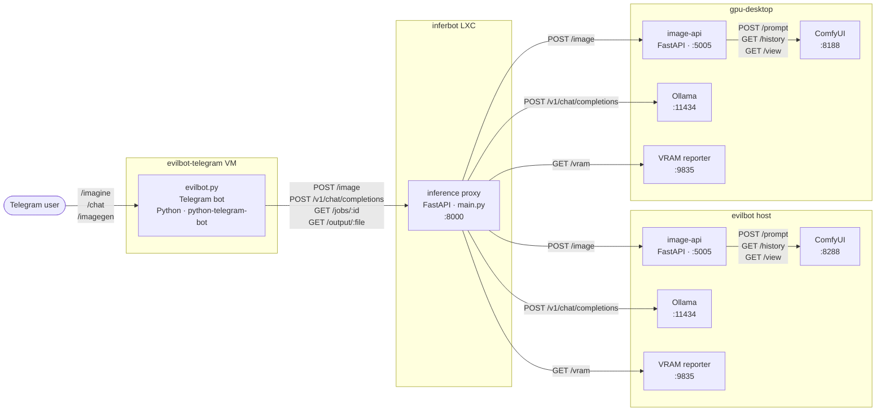
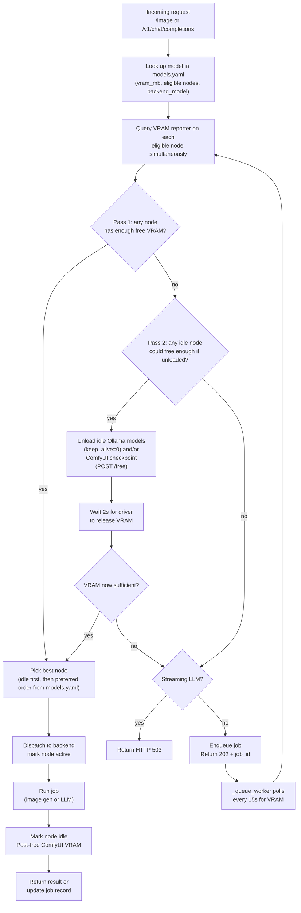
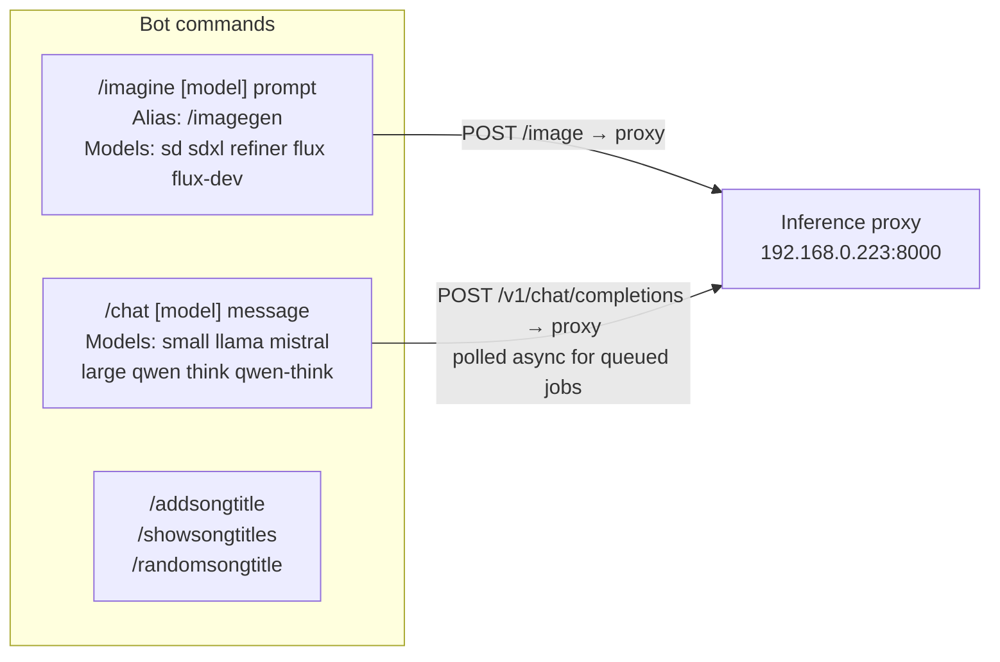
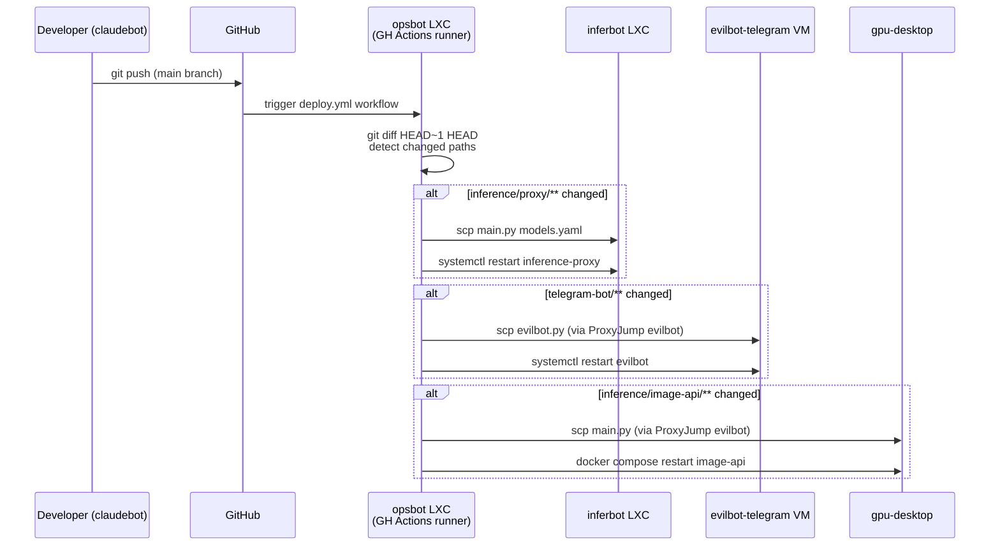
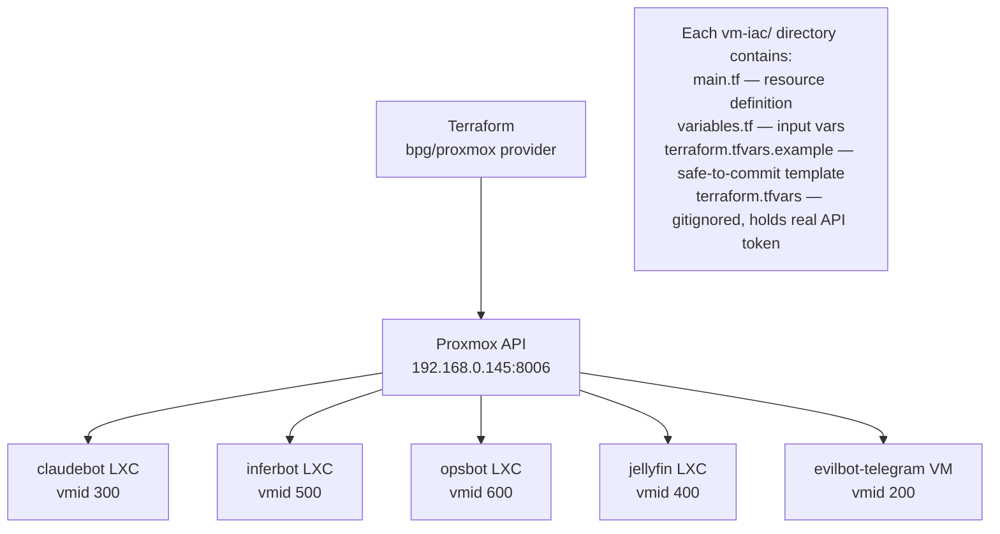
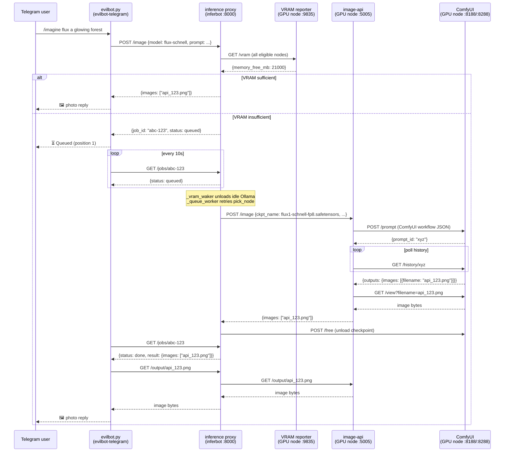

# System Architecture

This document describes the full architecture of the evilbot homelab: hardware, virtual machines, services, inference pipeline, and CD automation.

---

## Hardware

| Host | Role | GPU | VRAM | Notes |
|---|---|---|---|---|
| evilbot | Proxmox hypervisor | RTX 3070 | 8 GB | Runs all LXC/VM guests; 22 TB ZFS pool `tank` |
| gpu-desktop | Bare-metal desktop | RTX 3090 | 24 GB | User's workstation; runs inference services |

Both GPU hosts run:
- **ComfyUI** — image generation backend
- **Ollama** — LLM backend
- **image-api** — thin FastAPI wrapper that translates inference proxy requests into ComfyUI workflows
- **VRAM reporter** — lightweight HTTP server that exposes live `nvidia-smi` stats on port 9835

---

## VM / Container Topology

---

## Service Architecture

---

## Inference Routing — VRAM-Aware Scheduler

The inference proxy is the central brain. Every request goes through a two-pass node selection algorithm before a job is dispatched.

### VRAM Waker

A background task (`_vram_waker`) runs independently of the per-job retry loop. Every 15 seconds, if any jobs are queued, it scans all nodes that are not actively serving a request and proactively unloads any idle Ollama models and ComfyUI checkpoints. This handles cross-service blocking — for example, a completed LLM job leaving a model loaded in VRAM, blocking a queued image generation job on the same node.

---

## Model Catalog

Defined in `inference/proxy/models.yaml`. The proxy reads this at startup; editing and restarting the proxy is all that's needed to add or remove models.

| Model name | Type | VRAM (MB) | Eligible nodes | Backend |
|---|---|---|---|---|
| `sd-1.5` | imagegen | 4,000 | evilbot, gpu-desktop | ComfyUI checkpoint |
| `sdxl-base` | imagegen | 7,000 | evilbot, gpu-desktop | ComfyUI checkpoint |
| `sdxl-refiner` | imagegen | 7,000 | evilbot, gpu-desktop | ComfyUI checkpoint |
| `flux-schnell` | imagegen | 20,000 | gpu-desktop only | ComfyUI checkpoint (fp8) |
| `flux-dev` | imagegen | 22,000 | gpu-desktop only | ComfyUI checkpoint (fp8) |
| `llama-3-8b` | llm | 5,500 | evilbot, gpu-desktop | Ollama |
| `mistral-7b` | llm | 5,000 | evilbot, gpu-desktop | Ollama |
| `qwen-32b` | llm | 19,000 | gpu-desktop only | Ollama |
| `qwen-32b-think` | llm | 19,000 | gpu-desktop only | Ollama (with `think: true`) |

Node candidate order in models.yaml determines preference: small models list evilbot first so the RTX 3070 handles light workloads and leaves the RTX 3090 free for large-only models.

---

## Telegram Bot — Command Reference

**Chain-of-thought (think mode):** When the bot receives a response containing a `<think>...</think>` block from Qwen 2.5's reasoning mode, it wraps the reasoning in a Telegram `<tg-spoiler>` tag (tap-to-reveal) and shows the final answer plaintext below.

**Async job polling:** Image generation requests return a `job_id` immediately. The bot sends a "Queued…" status message, then polls `GET /jobs/{job_id}` every 10 seconds. When the job transitions to `running` it edits the status message to "Generating…"; when `done` it fetches the image from `GET /output/{filename}` and replies with a photo.

---

## CD Pipeline

**Path-based gating:** The `changes` job diffs `HEAD~1..HEAD` and outputs boolean flags (`proxy`, `bot`, `image_api`). Each deploy job is conditional on its flag — a commit touching only `telegram-bot/` skips the proxy and image-api deploys entirely.

**opsbot SSH topology:** opsbot holds a single SSH keypair. Its `~/.ssh/config` defines:
- `inferbot` — direct (same LAN)
- `evilbot-telegram` — via `ProxyJump evilbot` (evilbot is the jump host)
- `gpu-desktop` — via `ProxyJump evilbot`

opsbot has no SSH access beyond these deploy targets. It holds no Proxmox API tokens and no Telegram bot credentials.

---

## Infrastructure as Code

All containers and VMs are provisioned via Terraform using the `bpg/proxmox` provider (~0.73). Each service has its own directory under `vm-iac/`.

---

## Data Flow — Image Generation (end to end)

---

## Security Posture

| Boundary | Policy |
|---|---|
| inferbot → GPU nodes | HTTP only to inference ports (ComfyUI, Ollama, image-api, VRAM reporter). No SSH keys. No Proxmox API access. |
| opsbot → deploy targets | SSH keypair scoped to inferbot, evilbot-telegram, gpu-desktop, and evilbot as jump host only. No Proxmox API tokens. |
| claudebot | AI workspace only — no production daemons, no CI runners, no deploy automation. |
| Public repo | LAN IPs and SSH public keys are safe to commit. All secrets live in gitignored `*.tfvars` / `.env` files; `*.example` templates are committed instead. |
| evilbot Proxmox API tokens | Minimum scope per operation (read-only vs. container management). Never combine `Sys.PowerMgmt + Datastore.Allocate + VM.Config.Disk` in one token. |
