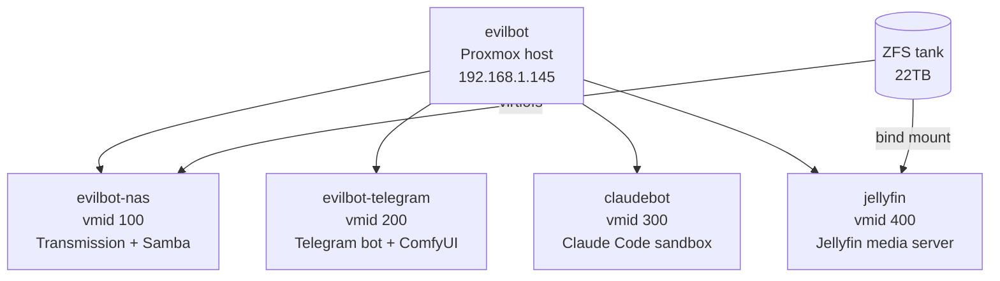

# Plan: GitHub Sync & Portfolio Repo

**Goal:** Keep this homelab repo synced to GitHub in a way that's safe to make public.

> **The secret hygiene rules in this plan are also summarised in `CLAUDE.md` under "Security & Secret Hygiene" so they're visible during all development, not just at publish time.**

---

## Status

- [ ] Phase 1: Repo setup & secret audit
- [ ] Phase 2: Initial push
- [ ] Phase 3: Ongoing sync workflow

---

## Phase 1: Repo Setup & Secret Audit

### 1.1 Initialize git repo

```bash
cd /root
git init
git add CLAUDE.md docs/ .claude/plans/
```

Do NOT add:
- `/root/.secrets/` or any `*.env` files
- `*.tfvars`, `terraform.tfstate`, `.terraform/`
- `/opt/evilbot/.env` (on the Telegram VM — lives there, not here)
- Any file containing real credentials

### 1.2 .gitignore

Create `/root/.gitignore`:
```
.secrets/
*.tfvars
terraform.tfstate
terraform.tfstate.backup
.terraform/
*.env
*.db
__pycache__/
venv/
```

### 1.3 Redact sensitive values before committing

Files that need scrubbing before they're safe to publish:

| File | Sensitive content | Action |
|---|---|---|
| `CLAUDE.md` | LAN IPs (`192.168.1.x`), Tailscale domain | Template with `<proxmox-host-ip>`, `<tailscale-domain>` — or leave as-is (RFC1918 IPs are not routable externally, low risk) |
| `docs/evilbot-nas.md` | RPC credentials reference | Already references `/etc/transmission-remote.env`, not hardcoded — safe |
| `docs/evilbot-telegram.md` | No secrets hardcoded — safe as-is | — |
| `infra/terraform.tfvars` | API token secrets | Excluded by .gitignore; provide `terraform.tfvars.example` instead |

**Never commit:**
- `TELEGRAM_BOT_TOKEN`
- Transmission RPC password
- Proxmox API token secrets
- Any real password

### 1.4 Add .env.example / tfvars.example files

For any secret-bearing config, commit a sanitized example:

`infra/terraform.tfvars.example`:
```hcl
proxmox_api_token = "user@realm!tokenid=<your-token-secret>"
ssh_public_key    = "<your-ssh-public-key>"
```

---

## Phase 2: Initial Push

```bash
gh auth login   # or set GITHUB_TOKEN
gh repo create evilbot-homelab --public --description "Homelab IaC, bots, and docs"
git remote add origin https://github.com/<you>/evilbot-homelab.git
git branch -M main
git push -u origin main
```

Consider adding a top-level `README.md` that explains the project for portfolio visitors.

---

## Phase 3: Ongoing Sync Workflow

Options (pick one):

**Manual:** just `git add / commit / push` from `/root` after making changes.

**Automated:** add a Claude Code hook or cron that commits and pushes on a schedule — useful if you want the repo to stay fresh as a live portfolio artifact.

---

## What's Safe to Make Public

| Content | Safe? | Notes |
|---|---|---|
| `CLAUDE.md` with LAN IPs | Mostly yes | RFC1918 IPs (`192.168.x.x`) are not routable from the internet. Tailscale domain leaks membership but is low-risk. |
| SSH public key in CLAUDE.md | Yes | Public keys are meant to be shared. |
| `docs/evilbot-nas.md` | Yes | No secrets; describes architecture and scripts. |
| `docs/evilbot-telegram.md` | Yes | Bot token is in `.env` on the VM, not here. |
| `docs/evilbot-telegram.md` — `IMAGEGEN_URL` Tailscale IP | Mild risk | Tailscale IPs are stable and specific to your account. Consider templating as `<imagegen-tailscale-ip>`. |
| Terraform configs | Yes | As long as `tfvars` (secrets) are gitignored and only `tfvars.example` is committed. |
| Plans | Yes | Architecture and reasoning — good portfolio content. |

## Portfolio Framing

This repo demonstrates:
- Infrastructure-as-Code for homelab VMs (Proxmox + Terraform)
- Custom system services (inotify-based torrent automation, Telegram bot)
- Operational practices (least-privilege API tokens, SSH key management, docs-as-code)
- AI-assisted infrastructure management (Claude Code as the operator)

---

## Phase 4: Visualization & Presentation (Portfolio Experiment)

**Goal:** Make the repo visually compelling and easy to navigate for someone landing on it
cold — a recruiter, collaborator, or technical reviewer who won't read every file.

### 4.1 README overhaul

The current README is minimal. A strong portfolio README includes:
- One-paragraph "what is this" summary
- Architecture diagram (see 4.2)
- What's in each directory (quick map)
- Key technical decisions and why (not just what)
- "How to reproduce" quick-start

### 4.2 Architecture diagram options

Experiment with at least two and pick the best:

**Option A — Mermaid (renders natively in GitHub)**

Pros: zero external dependency, renders in GitHub README automatically.
Cons: limited styling, looks generic.

**Option B — draw.io / Excalidraw (exported PNG committed to repo)**
Hand-drawn aesthetic (Excalidraw) or clean professional diagram (draw.io).
Export as SVG for crisp rendering at any size. Commit to `docs/assets/`.
Pros: looks polished, full control over layout and style.
Cons: manual to update when topology changes.

**Option C — GitHub Pages with a generated site**
Use a static site generator (MkDocs, Docusaurus, or just plain HTML) to turn
`docs/` into a browsable site hosted on `gh-pages` branch.
Pros: full portfolio presentation, searchable docs, custom domain possible.
Cons: more setup; another thing to maintain.

### 4.3 Repo badges

Add to README header — rendered as inline status indicators:

```markdown


```

If CI is set up (Phase 5 of `infra-testing.md`), add a live build status badge.

### 4.4 Directory README files

Add a short `README.md` to each major subdirectory so GitHub renders a description
when you browse into it:
- `vm-iac/README.md` — what each Terraform module does
- `docs/README.md` — index of all service docs
- `plans/README.md` — project status overview (mirrors CLAUDE.md active projects)

### 4.5 GitHub repo metadata

In the repo settings (Settings → General):
- **Description:** already set ("an evil bot for dastardly and dangerous tasks and services") — keep or make more portfolio-appropriate
- **Website:** set to GitHub Pages URL if 4.3 is implemented
- **Topics:** add `homelab`, `proxmox`, `terraform`, `jellyfin`, `self-hosted`, `iac`

### Experiment approach

Don't commit to one approach — prototype all three diagram options in a branch,
render them, and pick the one that best represents the project. Then decide whether
GitHub Pages is worth the overhead.
